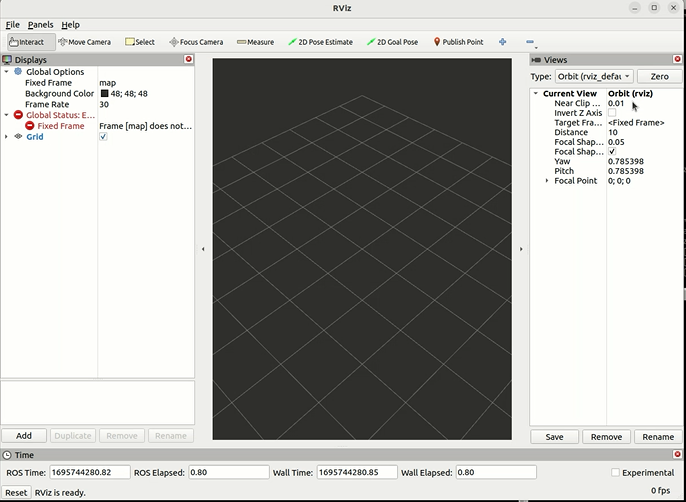
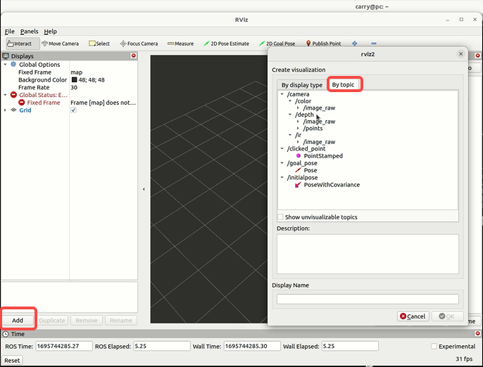
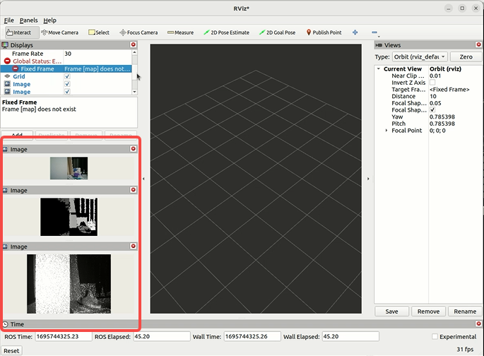
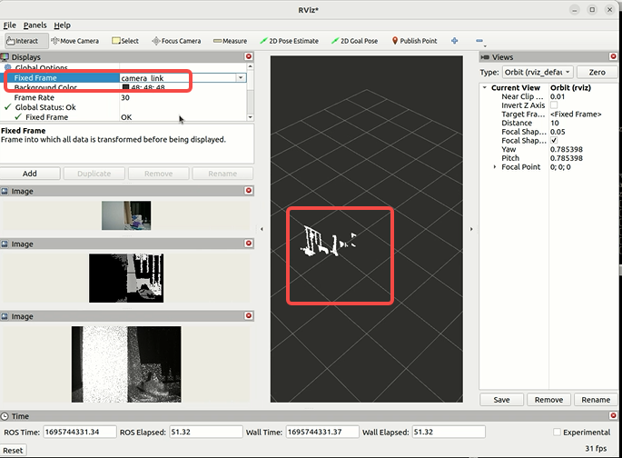

# 功能介绍

tros_astra_camera包用于连接Orbbec Astro Pro相机，以ROS2标准消息格式发布RGB、IR、以及深度数据。

# 物品清单

| 物料选项    | 清单      | 
| ------- | ------------ | 
| RDK X3  | [购买链接](https://developer.horizon.ai/sunrise) | 
| 奥比中光 Astro Pro | [购买链接](https://detail.tmall.com/item.htm?abbucket=4&id=658931115688&rn=18da33618037ecec87a96b391dc3d5b4&spm=a1z10.5-b-s.w4011-22651484606.74.63a11e0bWkXDQT&skuId=4746660164483) | 

# 使用方法

## 准备工作

1. 地平线RDK已烧录好地平线提供的Ubuntu 20.04系统镜像。

2. 奥比中光Astro Pro正确链接RDK X3

## 安装奥比中光Astro Pro驱动

通过终端或者VNC连接RDK X3，执行以下命令

```bash
sudo apt update
sudo apt install -y tros_astra_camera_pro
```
## 运行奥比中光Astro Pro

在RDK终端中，执行以下命令启动Astro Pro

```bash
source /opt/tros/setup.bash
ros2 launch astra_pro_camera astra_pro.launch.xml
```

## 查看Astro Pro数据

### 使用rviz可视化

***注意：运行前请确保rviz已正确安装，运行rviz的PC应与RDK设备处于同一网段***

1. PC上执行以下命令启动rviz2

```bash
source /opt/ros/humble/setup.bash
ros2 run rviz2 rviz2
```




2. 在Rviz中点击"Add"->"By Topic"依次添加/camera/color/image_raw，/depth/image_raw，/depth_points, /ir/image_raw话题至Rivz中。



3. 添加完上述Topics后，可看到Rviz左侧已经展示RGB、IR、Depth图像



4. 更改参考坐标系为camera_link，在Rviz中展示深度点云图




# 接口说明

## 话题

### 发布话题
| 话题                       | 类型                                | 描述                    |
|----------------------------|------------------------------------|-------------------------|
| /camera/color/camera_info  | sensor_msgs/msg/CameraInfo         | 彩色相机信息             |
| /camera/color/image_raw    | sensor_msgs/msg/Image              | 彩色数据流图像           |
| /camera/depth/camera_info  | sensor_msgs/msg/CameraInfo         | 深度相机信息             |
| /camera/depth/image_raw    | sensor_msgs/msg/Image              | 深度相机数据流图像        |
| /camera/depth/points       | sensor_msgs/msg/PointCloud2        | 点云数据                 |
| /camera/ir/camera_info     | sensor_msgs/msg/CameraInfo         | IR相机信息               |
| /camera/ir/image_raw       | sensor_msgs/msg/Image              | 红外数据流图像           |

## 参数

   | 参数名                        | 数据类型 | 描述                                                         |
   | -----------------------------| -------- | ------------------------------------------------------------ |
   | enable_point_cloud           | bool     | 是否开启点云。 默认为true                        |
   | enable_colored_point_cloud   | bool     | 是否开启彩色点云。 默认为false                                 |
   | point_cloud_qos              | string   | ROS2消息质量服务（QoS）设置。可能的值是`SYSTEM_DEFAULT`，`DEFAULT`，`PARAMETER_EVENTS`，`SERVICES_DEFAULT`，`PARAMETERS`，`SENSOR_DATA`                     |
   | enable_d2c_viewer            | bool     | 发布D2C叠加图像（仅用于测试）。 默认值为false                             |
   | device_num                   | int      | 设备数量。如果需要多个相机，则必须填写此项。 |
   | color_width                  | int      | 彩色图像流宽分辨率 |
   | color_height                 | int      | 彩色图像流搞分辨率 |
   | color_fps                    | int      | 彩色图像流帧率 |
   | ir_width                     | int      | 红外图像流宽分辨率 |
   | ir_height                    | int      | 红外图像流搞分辨率 |
   | ir_fps                       | int      | 红外图像流帧率 |
   | depth_width                  | int      | 深度图像流宽分辨率 |
   | depth_height                 | int      | 深度图像流搞分辨率 |
   | depth_fps                    | int      | 深度图像流帧率 |
   | enable_color                 | bool     | 是否启用RGB相机 |
   | enable_depth                 | bool     | 是否启用深度相机 |
   | enable_ir                    | bool     | 是否开启IR相机 |
   | enable_depth                 | bool     | 是否启用深度相机 |
   | depth_registration           | bool     | 是否启用将深度帧硬件对齐到彩色帧。当`enable_colored_point_cloud`设置为`true`
  时，此字段也要设置为`true` |
   | usb_port                     | string    | USB端口号，当使用多个相机时，这是必需的 |
   | enable_accel                 | bool      | 是否启用加速度计 |
   | accel_rate                   | string    | 加速度计的频率， 可选值为`1.5625hz`,`3.125hz`,`6.25hz`,`12.5hz`,`25hz`,`50hz`,
  `100hz`,`200hz`,`500hz`,`1khz`,`2khz`,`4khz`,`8khz`,`16khz`,`32khz`。具体的值取决于当前的相机型号 |
   | accel_range                  | string    | 加速度计的量程, 可选值为`2g`,`4g`,`8g`,`16g`。具体的值取决于当前的相机型号 |
   | enable_gyro                  | bool     | 是否启用陀螺仪 |
   | gyro_rate                    | string   | 陀螺仪的频率, 可选值为`1.5625hz`,`3.125hz`,`6.25hz`,`12.5hz`,`25hz`,`50hz`,
  `100hz`,`200hz`,`500hz`,`1khz`,`2khz`,`4khz`,`8khz`,`16khz`,`32khz`。具体的值取决于当前的相机型号 |
   | gyro_range                   | string     | 陀螺仪的量程, 可选值为`16dps`,`31dps`,`62dps`,`125dps`,`250dps`,`500dps`,`1000dps`,`2000dps`
  。具体的值取决于当前的相机型号 |
   
   