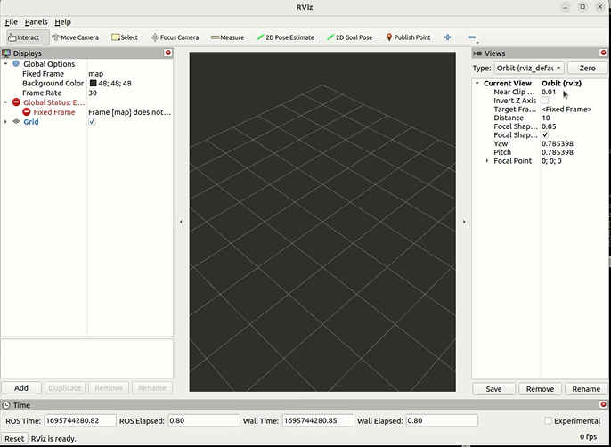
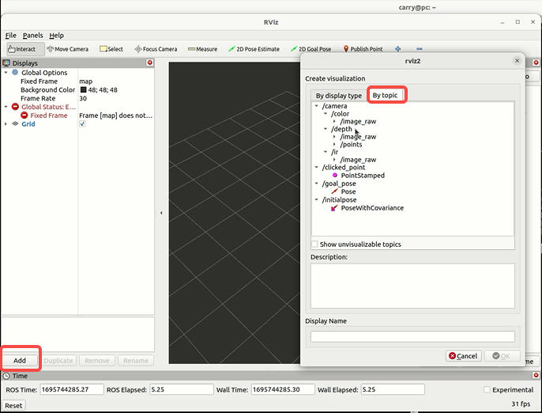
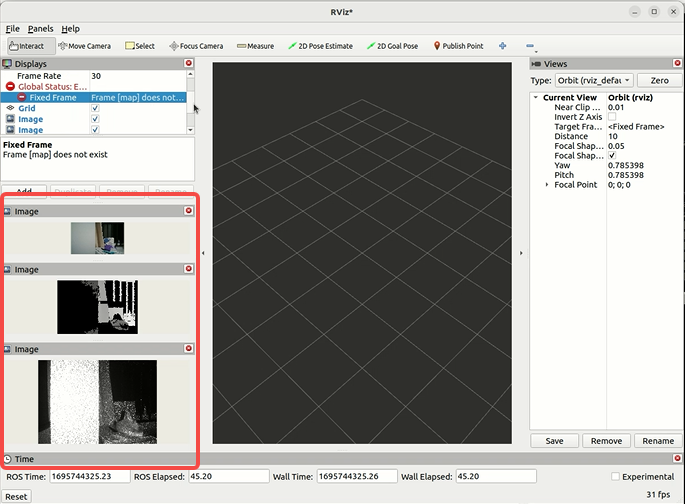
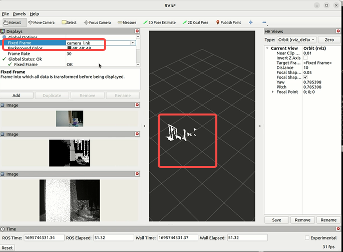

English| [简体中文](./README_cn.md)

# Function Introduction

The tros_astra_camera package is used to connect the Orbbec Astro Pro camera and publish RGB, IR, and depth data in ROS2 standard message format.

# Inventory

| Item Option  | List         | 
| ------------ | ------------ | 
| RDK X3       | [Purchase Link](https://developer.horizon.ai/sunrise) | 
| Orbbec Astro Pro | [Purchase Link](https://detail.tmall.com/item.htm?abbucket=4&id=658931115688&rn=18da33618037ecec87a96b391dc3d5b4&spm=a1z10.5-b-s.w4011-22651484606.74.63a11e0bWkXDQT&skuId=4746660164483) | 

# Usage

## Preparation

1. Horizon RDK has been flashed with the Horizon-provided Ubuntu 20.04 system image.

2. Orbbec Astro Pro is correctly connected to RDK X3.

## Install Orbbec Astro Pro Driver

Connect to RDK X3 through terminal or VNC, and execute the following commands

tros foxy: 
```bash
sudo apt update
sudo apt install -y tros-astra-pro-camera
```
tros humble:
```bash
sudo apt update
sudo apt install -y tros-humble-astra-pro-camera
```

## Run Orbbec Astro Pro

In the RDK terminal, execute the following command to start Astro Pro

tros foxy:
```bash
source /opt/tros/setup.bash
ros2 launch astra_pro_camera astra_pro.launch.xml
```
tros humble:
```bash
source /opt/tros/humble/setup.bash
ros2 launch astra_pro_camera astra_pro.launch.xml
```

## View Astro Pro Data

### Visualize using rviz

***Note: Make sure rviz is installed correctly before running. The PC running rviz should be on the same network segment as the RDK device***

1. Execute the following command on the PC to start rviz2

    tros foxy:
    ```bash
    source /opt/ros/foxy/setup.bash
    ros2 run rviz2 rviz2
    ```
    tros humble:
    ```bash
    source /opt/ros/humble/setup.bash
    ros2 run rviz2 rviz2
    ```

2. Click "Add"->"By Topic" in Rviz and add topics /camera/color/image_raw, /depth/image_raw, /depth_points, /ir/image_raw to Rviz in sequence.



3. After adding the above topics, you can see RGB, IR, Depth images displayed on the left side of Rviz.



4. Change the reference coordinate system to camera_link and display the depth point cloud image in Rviz.



# Interface Description

## Topics

### Published Topics
| Topic                        | Type                                | Description              |
|------------------------------|------------------------------------|--------------------------|
| /camera/color/camera_info    | sensor_msgs/msg/CameraInfo         | Color camera information |
| /camera/color/image_raw      | sensor_msgs/msg/Image              | Color image raw data     |
| /camera/depth/camera_info    | sensor_msgs/msg/CameraInfo         | Depth camera information |
| /camera/depth/image_raw      | sensor_msgs/msg/Image              | Depth camera image raw data |
| /camera/depth/points         | sensor_msgs/msg/PointCloud2        | Point cloud data         |
| /camera/ir/camera_info       | sensor_msgs/msg/CameraInfo         | IR camera information     |
| /camera/ir/image_raw         | sensor_msgs/msg/Image              | IR image raw data         |

## Parameters

| Parameter Name               | Data Type | Description                                                  |
| ---------------------------- | --------- | ------------------------------------------------------------ |
| enable_point_cloud           | bool      | Enable point cloud. Default is true                         |
| enable_colored_point_cloud   | bool      | Enable colored point cloud. Default is false                 |
| point_cloud_qos              | string    | Quality of Service (QoS) setting for ROS2 messages. Possible values are `SYSTEM_DEFAULT`, `DEFAULT`, `PARAMETER_EVENTS`, `SERVICES_DEFAULT`, `PARAMETERS`, `SENSOR_DATA` |
| enable_d2c_viewer            | bool      | Publish D2C overlaid images (for testing purpose only). Default is false |
| device_num                   | int       | Number of devices. Must be filled if multiple cameras are needed. |
| color_width                  | int       | Color image stream width resolution |
| color_height                 | int       | Color image stream height resolution |
| color_fps                    | int       | Color image stream frame rate |
| ir_width                     | int       | IR image stream width resolution |
| ir_height                    | int       | IR image stream height resolution |
| ir_fps                       | int       | IR image stream frame rate |
| depth_width                  | int       | Depth image stream width resolution |
| depth_height                 | int       | Depth image stream height resolution |
| depth_fps                    | int       | Depth image stream frame rate |
| enable_color                 | bool      | Enable RGB camera or not || enable_depth                 | bool     | Whether to enable the depth camera |
| enable_ir                    | bool     | Whether to turn on the IR camera |
| enable_depth                 | bool     | Whether to enable the depth camera |
| depth_registration           | bool     | Whether to enable aligning depth frames to color frames. When setting `enable_colored_point_cloud` to `true`, this field should also be set to `true` |
| usb_port                     | string    | USB port number, necessary when using multiple cameras |
| enable_accel                 | bool      | Whether to enable the accelerometer |
| accel_rate                   | string    | Accelerometer sampling rate, optional values are `1.5625hz`,`3.125hz`,`6.25hz`,`12.5hz`,`25hz`,`50hz`,`100hz`,`200hz`,`500hz`,`1khz`,`2khz`,`4khz`,`8khz`,`16khz`,`32khz`. Specific values depend on the current camera model |
| accel_range                  | string    | Accelerometer range, optional values are `2g`,`4g`,`8g`,`16g`. Specific values depend on the current camera model |
| enable_gyro                  | bool     | Whether to enable the gyroscope |
| gyro_rate                    | string   | Gyroscope sampling rate, optional values are `1.5625hz`,`3.125hz`,`6.25hz`,`12.5hz`,`25hz`,`50hz`,`100hz`,`200hz`,`500hz`,`1khz`,`2khz`,`4khz`,`8khz`,`16khz`,`32khz`. Specific values depend on the current camera model |
| gyro_range                   | string     | Gyroscope range, optional values are `16dps`,`31dps`,`62dps`,`125dps`,`250dps`,`500dps`,`1000dps`,`2000dps`. Specific values depend on the current camera model |